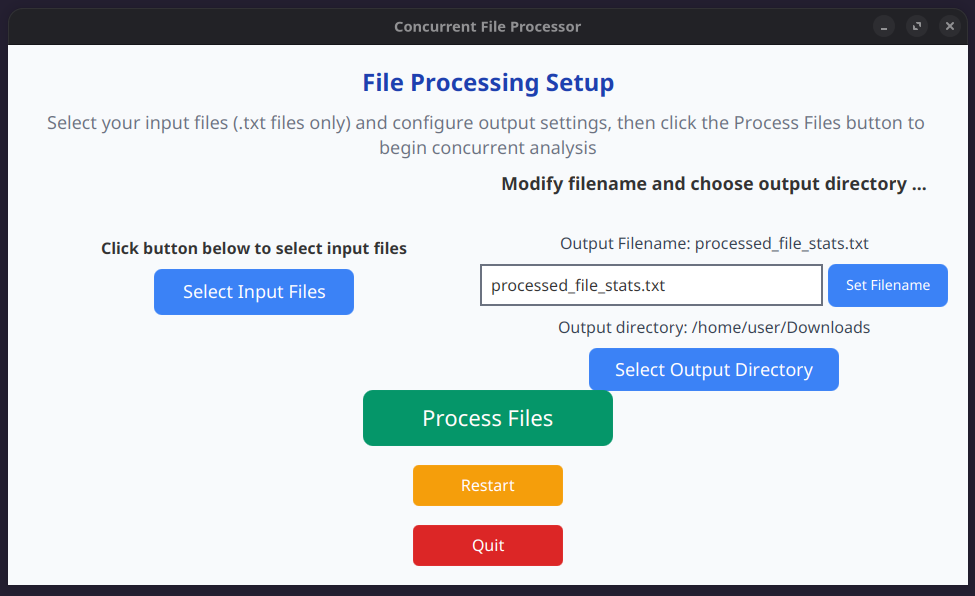
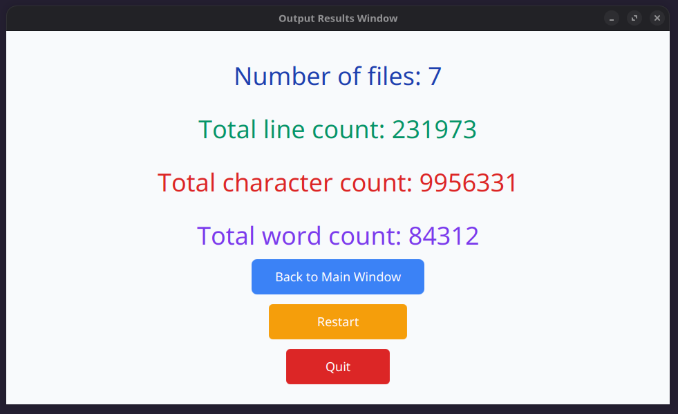
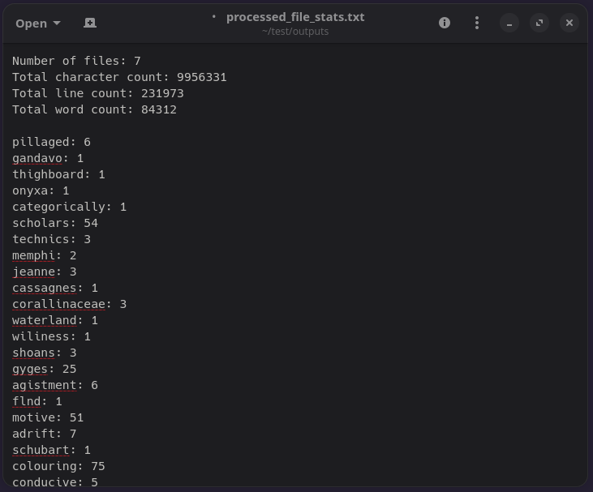

# Concurrent File Processor

Built to explore Java concurrency, implements work-stealing thread pools for parallel file analysis, with a clean JavaFX GUI and headless CLI mode.

## 📑 Table of Contents

- [Features](#-features)
- [Quickstart](#-quickstart)
- [Download and Run](#-download-and-run)
- [Usage](#-usage)
- [Input & Output](#-input--output)
- [Code Structure](#-code-structure)
- [Requirements](#-requirements)
- [Testing](#-testing)

## 🚀 Features

- **Concurrent Processing**: Utilizes work-stealing thread pools for optimal performance
- **Two Interface Modes**: 
  - **GUI Mode**: Modern JavaFX interface with intuitive file selection and configuration
  - **Headless Mode**: Command-line interface for automation and server environments
- **File Processing Features**: 
  - Word frequency counting
  - Total character count across all files
  - Total line count across all files
  - File count tracking
- **Customizable Output**: Customizable output filename and directory
- **Cross-Platform**: Works on Windows and Linux

## Screenshots

### Setup Screen


### Output Screen


### Output File


## ⚡ Quickstart

### 🐧 Linux

1. **Download** the latest AppImage from [Releases](https://github.com/goodwin-sam/concurrent-file-processor/releases)
2. **Make it executable**: `chmod +x concurrent-file-processor-vX.X.X-x86_64.AppImage`
3. **Run**:
   - Double-click the `.AppImage` file
   - Or run from terminal: `./concurrent-file-processor-vX.X.X-x86_64.AppImage` or `./concurrent-file-processor-vX.X.X-x86_64.AppImage --headless`

### 🪟 Windows

1. **Download** the latest zip file from [Releases](https://github.com/goodwin-sam/concurrent-file-processor/releases)
2. **Extract** the zip file to a location of your choice
3. **Run**:
   - Double-click the `.exe` file in the extracted folder
   - Or run from PowerShell/command prompt: navigate to the extracted folder, and run: `./concurrent-file-processor-vX.X.X-amd64.exe` or `./concurrent-file-processor-vX.X.X-amd64.exe --headless`

### 📊 Process Your Data

Once the application is running (on either platform):

- **If in GUI**: Select your text files and output directory, then click "Process Files" to begin processing
- **If in headless**: The application will automatically process all text files in the current directory, and prompt user for output file name.  Then the results appear in the console and the output file appears in the working directory.


### Developers
```bash
# Clone and build
git clone https://github.com/goodwin-sam/concurrent-file-processor.git
cd concurrent-file-processor
mvn clean package

# Run GUI mode
mvn javafx:run

# Or run headless mode
mvn javafx:run -Djavafx.args="--headless"
```

## 📥 Download and Run

> **💡 Note**: No installation required - these are portable executables that run directly.

### Linux AppImage
Download the latest Linux AppImage from [Releases](https://github.com/goodwin-sam/concurrent-file-processor/releases):

- **concurrent-file-processor-vX.X.X-x86_64.AppImage** - Portable standalone executable
- **Includes Java runtime** - Works on any Linux distribution without Java installation
- **Can be run from anywhere** - The AppImage is a single file that can be placed and executed from any location

#### Running the AppImage
Double click the appimage file or Run from Terminal

```bash
# Run directly with GUI (can be run from any directory)
./concurrent-file-processor-vX.X.X-x86_64.AppImage

# or Run directly headless (can be run from any directory)
./concurrent-file-processor-vX.X.X-x86_64.AppImage --headless
```

### Windows Executable

Download the latest Windows zip file from [Releases](https://github.com/goodwin-sam/concurrent-file-processor/releases):

- **concurrent-file-processor-vX.X.X-amd64.zip** - Portable folder package
- **Includes Java runtime** - Works on Windows without Java installation
- **Portable folder structure** - The extracted folder contains all necessary files and can be moved to any location, but the executable must be run from within the extracted folder

#### Contents of the zip file:
- `jre/` folder - Java runtime environment
- `concurrent-file-processor-vX.X.X-amd64.exe` - Executable to run the application
- `concurrent-file-processor-1.0-SNAPSHOT-jar-with-dependencies.jar` - Application JAR file

#### Running on Windows

1. **Extract** the zip file to any location
2. **Navigate to the extracted folder** - The executable must be run from within this folder
3. **GUI Mode**: Double-click `concurrent-file-processor-vX.X.X-amd64.exe` from within the extracted folder
4. **Headless Mode**: Open Command Prompt or PowerShell in the extracted folder and run:
   ```
   .\concurrent-file-processor-vX.X.X-amd64.exe --headless
   ```

## 🎯 Usage

### GUI Mode (Default)

The GUI provides a three-window workflow:
1. **Start Window**: Welcome screen with navigation
2. **Main Window**: File selection and output configuration
3. **Output Window**: Results display and navigation to restart or go back to main window

### Headless Mode

In headless mode, the application:
- Prompts for output filename or uses default
- Scans the current directory for `.txt` files
- Processes them concurrently
- Displays results in the console
- Writes results in an output file

## 📁 Input & Output

### Supported Input
- **File Types**: `.txt` files only
- **File Size**: No practical limits, distributes pieces of files across other threads if other threads are waiting

### Output Format
The application generates a comprehensive report with:
```
Number of files: [count]
Total character count: [count]
Total line count: [count]
Total word count: [count]
[word1]: [frequency]
[word2]: [frequency]
...
```

### Output Location
- **Default**: Downloads directory
- **Customizable**: User can specify any directory and filename

## 🏛️ Code Structure

The application follows clean architecture principles with clear separation of concerns:

### Code Architecture

- `ConcurrentFileProcessor`: the main entry point into the program
- `FileStats`: the class that contains the statistics the program collects

- **Runner**: handles the different ways the program can run
    - `GuiRunner` handles running the program via GUI window
    - `HeadlessRunner` handles running the program via terminal
- **Processor**: handles the file processing capabilities of the program
    - `FileProcessor` handles file processing workflow
    - `ThreadDelegator` manages thread pools for parallel processing
    - `FileMetricsCollector` handles individual file analysis
    - `OutputWriter` creates formatted output file for file statistics
- **Gui**: handles the gui portion of the program
    - `JavaFxApp` is the entry point for the gui window
    - **Window**: contains the gui windows and components
        - `Controller` manages window navigation
        - `StartWindow`, `MainWindow`, `OutputWindow` handle the layout of each window
        - **Components**: handles the creation of the individual components for all windows
            - `StartWindowComponents`, `MainWindowComponents`, `OutputWindowComponents` creates the compenents for each window

### Directory Structure

```
concurrent-file-processor/
├── src/main/java/com/concurrentfileprocessor/
│   ├── ConcurrentFileProcessor.java    # Main entry point
│   ├── FileStats.java                  # Data model for statistics
│   ├── processor/                      # Core processing logic
│   ├── runner/                         # Application launchers
│   └── gui/                            # JavaFX user interface
│       └── window/components            # Window management and UI components
├── src/test/java/                      # Comprehensive test suite
├── demo_input_files/                   # Sample text files
└── pom.xml                             # Maven and CI configuration
```

## 📋 Requirements

- **Java 17** or higher
- **Maven 3.6+** for building
- **JavaFX 21** (included in dependencies)


## 🧪 Testing

Run the comprehensive test suite:
```bash
# Run all tests
mvn test
```

The test suite covers:
- Core functionality
- Thread safety
- File processing
- Error handling
- GUI components


